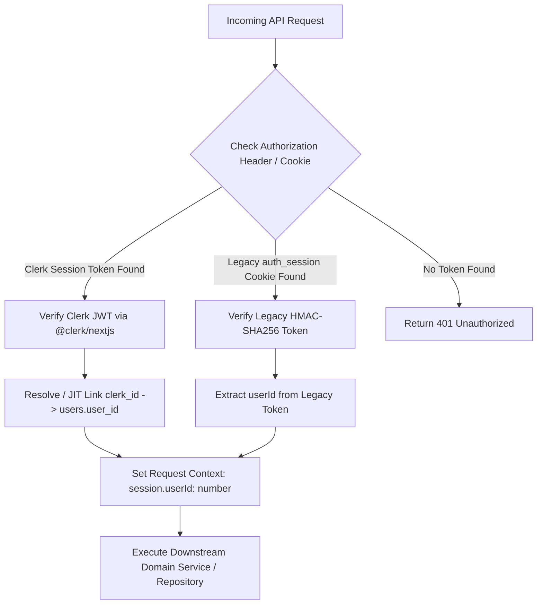

# Phase 6A.1: Clerk Migration Readiness & Identity-Linking Design Review

**Document Version:** 1.0.0  
**Status:** Pre-Implementation Architectural Specification & Threat Model  
**Author:** Senior Staff Engineer, Security Architect & Database Migration Reviewer  
**Date:** September 2026  

---

## 1. Executive Summary

This design review establishes the **formal identity-linking contract, security threat model, database compatibility bounds, and zero-data-loss migration strategy** for transitioning CampusLit from its interim custom cryptographic authentication engine to **Clerk Managed Identity**.

### Core Architecture Invariant
> **The CampusLit internal identity `users.userId` (`bigint` mode: `number`) MUST remain the stable, immutable surrogate primary key across all 9 relational application domains.** Under no circumstances will `users.userId` be converted to a string or replaced by Clerk's `user_id`. Clerk's external user identifier (`user_...`) will act strictly as an authentication handle mapped to the internal `userId`.

---

## 2. Verification of Current Authentication Architecture

### 2.1 Current Identity Resolution Pipeline
1. **Request Reception**: An incoming HTTP request carries an `auth_session` cookie (or `Authorization: Bearer` header).
2. **Edge Interception (`middleware.ts`)**: Applies tiered sliding-window rate limiting (`AUTH`: 30/min, `MUTATION`: 120/min, `READ`: 300/min).
3. **Cryptographic Validation (`lib/auth.ts`)**:
   - `getAuthenticatedUser(request)` extracts the cookie token `<payload>.<signature>`.
   - The HMAC-SHA256 signature is verified against configured keys in `AUTH_SESSION_SECRETS` using constant-time `crypto.timingSafeEqual()`.
   - The token expiration (`exp`) is compared to `Math.floor(Date.now() / 1000)`.
   - The payload schema is validated to guarantee `userId` is a positive `number` and `role` is valid (`student | admin | faculty`).
4. **Downstream Execution**: Route handlers extract `session.userId` and pass it directly to Domain Services $\to$ Repositories.
5. **No Client Trust**: **Zero API route handlers accept a client-provided `userId` from the request body.** Client payloads attempting to specify `userId` are strictly ignored and overwritten with `session.userId`.

---

## 3. Internal Identity Dependency Map (`users.userId`)

Every user-dependent entity in CampusLit references `users.userId` as a **PostgreSQL integer auto-increment identity (`bigint`, mode: `number`)**:

```
users (PK: user_id [bigint identity / number])
 ├── student_profiles (PK: user_id [FK -> users.user_id, ON DELETE CASCADE])
 ├── student_settings (PK: user_id [FK -> users.user_id, ON DELETE CASCADE])
 ├── attendance_logs (FK: user_id -> users.user_id, ON DELETE CASCADE)
 ├── attendance_summaries (FK: user_id -> users.user_id, ON DELETE CASCADE)
 ├── student_cie_marks (FK: user_id -> users.user_id, ON DELETE CASCADE) [Unique: (user_id, cie_id)]
 ├── student_scholarship_bookmarks (FK: user_id -> users.user_id, ON DELETE CASCADE) [Composite PK]
 ├── student_opportunities (FK: user_id -> users.user_id, ON DELETE CASCADE) [Composite PK]
 ├── student_roadmap_progress (FK: user_id -> users.user_id, ON DELETE CASCADE)
 └── chat_threads (FK: user_id -> users.user_id, ON DELETE CASCADE)
      └── chat_messages (FK: chat_id -> chat_threads.chat_id, ON DELETE CASCADE)
```

### Dependency Audit Findings:
- **Relational Integrity**: 9 distinct tables depend on `users.userId` with `onDelete: "cascade"`.
- **Type Invariant**: All foreign keys are typed as `bigint("user_id", { mode: "number" })`.
- **Breaking Migration Risk**: Changing `users.userId` to a string (Clerk ID) would require dropping foreign keys, migrating 9 tables, rewriting all index definitions, and changing TypeScript mode from `number` to `string` across 10 repositories and 10 services.
- **Decision**: `users.userId` **MUST REMAIN AN INTEGER SURROGATE KEY**.

---

## 4. Clerk Identity-Linking Threat Model

The following decision matrix governs every edge case when resolving a Clerk external user ID (`clerk_...`) to a CampusLit internal `userId`:

| Case | Scenario Description | Action | Security Rationale & Enforcement |
| :--- | :--- | :---: | :--- |
| **A** | **Brand-New Clerk User** (No matching `clerk_id` or `email` in PostgreSQL) | **ALLOW** | Create row in `users` (`clerk_id: sub`, `email: primaryEmail`, `role: 'student'`) + default `student_settings`. Assigns new `user_id`. |
| **B** | **Existing CampusLit User Signing In via Clerk** (Matches unlinked `email` in DB) | **ALLOW (CONDITIONAL)** | **Allow ONLY if Clerk email status is `verified`.** Atomically updates `users.clerk_id = sub` where `users.email = normalized(email)`. |
| **C** | **Existing CampusLit User with Different Clerk Email** | **DENY** | Prevents arbitrary account hijacking. New user record is created under the new email; legacy account remains separate. |
| **D** | **Existing CampusLit User with Matching Verified Clerk Email** | **ALLOW** | Normal identity linking path. Existing attendance, marks, bookmarks, and profile remain completely attached to existing `user_id`. |
| **E** | **Conflicting Identity Information** (Clerk email matches User A, but metadata claims User B) | **DENY** | Primary verified email in Clerk is the sole canonical identity link. Metadata is ignored for security. |
| **F** | **Clerk Account Already Linked to Another CampusLit User** | **DENY** | Unique constraint on `users.clerk_id` prevents duplicate links. Returns `409 Conflict`. |
| **G** | **CampusLit User Attempts to Claim Another User's Account** | **DENY** | Rejected. Linking requires authenticated Clerk ownership of the exact verified primary email. |
| **H** | **Concurrent First-Login Requests** | **ALLOW (IDEMPOTENT)** | Handled via PostgreSQL `ON CONFLICT (email) DO UPDATE SET clerk_id = EXCLUDED.clerk_id WHERE users.clerk_id IS NULL`. |
| **I** | **Webhook Arrives Before/After First Request** | **ALLOW (IDEMPOTENT)** | Both webhook (`user.created`) and request-time JIT provisioning use idempotent upsert logic. |
| **J** | **Clerk Account Deleted** | **ALLOW** | Webhook (`user.deleted`) cascades deletion of PostgreSQL user and all 9 child tables via `onDelete: "cascade"`. |
| **K** | **CampusLit Account Deleted Locally** | **ALLOW** | Cascades child records in DB. Session token immediately returns `401 Unauthorized`. |
| **L** | **Email Address Changed in Clerk** | **ALLOW (VERIFIED)** | Webhook (`user.updated`) updates `users.email` only after Clerk marks the new email as `verified`. |
| **M** | **Suspended/Banned Clerk Account** | **DENY** | Clerk authentication fails at the edge before reaching CampusLit API handlers. |
| **N** | **Clerk API Outage** | **DENY** | Fails closed for security. Returns HTTP `503 Service Unavailable` or gracefully displays cached public data. |
| **O** | **Legacy Session Remains Active During Migration** | **ALLOW** | Auth adapter validates legacy HMAC token during dual-auth window; prompts user to link Clerk on next interactive visit. |

---

## 5. Email Matching Security Review

### Account Takeover Prevention
Matching `Clerk.email == CampusLit.email` presents a critical account takeover vector if an unverified email is accepted.

### Mandatory Verification Rules:
1. **Strict Verification Check**: Account linking is **STRICTLY PROHIBITED** if `email_addresses[0].verification.status !== "verified"`.
2. **Email Normalization**: All emails must be processed as `email.trim().toLowerCase()` prior to lookup.
3. **No Unverified Social Override**: If a user signs up via an unverified social provider whose email is not verified by that provider, linking is blocked until OTP verification completes.

---

## 6. Database Migration Design

### Evaluation of Schema Approaches

```
OPTION A: Single Nullable Column in `users` (RECOMMENDED)
users:
 ├── user_id: bigint PK (mode: number)
 ├── clerk_id: varchar(128) UNIQUE NULL
 ├── email: varchar(255) UNIQUE NOT NULL
 ├── password_hash: text NULL (nullable for Clerk-only users)
 └── role: varchar(30) NOT NULL DEFAULT 'student'

OPTION B: Separate Mapping Table `user_identity_mappings`
user_identity_mappings:
 ├── mapping_id: bigint PK
 ├── user_id: bigint FK -> users.user_id
 ├── provider: varchar(50) ('clerk')
 └── provider_user_id: varchar(128) UNIQUE

OPTION C: Replace `users.user_id` with `clerk_id`
(REJECTED: Destructive migration across 9 dependent tables)
```

### Recommendation: **OPTION A**
- **Safety**: Adds a single nullable column `clerk_id varchar(128) unique`.
- **Zero Breaking Changes**: Zero changes to foreign keys, indexes, or dependent tables.
- **High Query Performance**: Direct single-row lookup `WHERE clerk_id = :sub` without joins.

---

## 7. Session Migration & Dual-Authentication Strategy

### Recommended Model: **Gradual Dual-Authentication Window (30 Days)**



### Rollback Strategy:
If Clerk integration encounters issues in production, the application can immediately revert by disabling Clerk middleware and falling back 100% to the legacy HMAC auth engine.

---

## 8. Preserving the Downstream Authorization Contract

### Adapter Invariant:
The authentication adapter must return the exact existing `AuthSession` interface:

```typescript
export interface AuthSession {
  userId: number; // Internal PostgreSQL integer identity
  role: UserRole; // 'student' | 'admin' | 'faculty'
  iat: number;
  exp: number;
}
```

Because all 35 API routes and 10 domain services consume `AuthSession { userId: number }`, **ZERO lines of code across attendance, CIE, scholarships, opportunities, roadmap, action radar, or chat services will need modification**.

---

## 9. Clerk Feature Alignment vs. Current Gaps

| Capability | Current In-House Auth | Clerk Target Integration | Migration Requirement |
| :--- | :---: | :---: | :--- |
| **Student Registration** | Salted `scrypt` | Clerk Hosted / Custom `<SignUp />` | Wire Clerk `<SignUp />` component |
| **Student Login** | Custom HMAC Cookie | Clerk Hosted / Custom `<SignIn />` | Wire Clerk `<SignIn />` component |
| **Google Social SSO** | 🔴 MISSING | 🟢 Built-In (1-Click Google OAuth) | Configure Google OAuth credentials in Clerk |
| **Email Verification** | 🔴 MISSING | 🟢 Built-In (Automated OTP/Magic Link) | Enable Email Verification in Clerk dashboard |
| **Password Reset / Recovery** | 🔴 MISSING | 🟢 Built-In (Automated Email Flow) | Enable Self-Service Password Reset |
| **Multi-Factor Auth (MFA)** | 🔴 MISSING | 🟢 Built-In (TOTP / SMS / Passkeys) | Optional toggle in Clerk |
| **Admin User Management** | 🔴 MISSING | 🟢 Built-In Clerk Dashboard | Operators search/ban users in Clerk GUI |
| **Session Revocation** | 🟡 Stateless JWT | 🟢 Instant Server-Side Revocation | Managed by Clerk session tokens |
| **Academic State Storage** | 🟢 21 PG Tables | 🟢 21 PG Tables (Preserved) | Stored exclusively in PostgreSQL |

---

## 10. Environment Variables Architecture

### Current Variables (Retained)
- `DATABASE_URL` (PostgreSQL Connection String)
- `AUTH_SESSION_SECRET` / `AUTH_SESSION_SECRETS` (Retained for legacy dual-auth support)
- `NODE_ENV`
- `DB_MAX_CONNECTIONS`
- `DB_PREPARE_STATEMENTS`

### Future Clerk Variables (Phase 6A.2)
- `NEXT_PUBLIC_CLERK_PUBLISHABLE_KEY` (Public Client API Key: `pk_live_...` or `pk_test_...`)
- `CLERK_SECRET_KEY` (Private Server API Key: `sk_live_...` or `sk_test_...`)
- `CLERK_WEBHOOK_SIGNING_SECRET` (Svix Webhook Secret: `whsec_...`)
- `NEXT_PUBLIC_CLERK_SIGN_IN_URL=/login`
- `NEXT_PUBLIC_CLERK_SIGN_UP_URL=/register`
- `NEXT_PUBLIC_CLERK_AFTER_SIGN_IN_URL=/`
- `NEXT_PUBLIC_CLERK_AFTER_SIGN_UP_URL=/onboarding`

---

## 11. File Impact Map

### Files That Will Change (Phase 6A.2)
- `package.json` (add `@clerk/nextjs`, `svix`)
- `middleware.ts` (combine Clerk middleware with rate limiter)
- `app/layout.tsx` (wrap with `<ClerkProvider>`)
- `lib/auth.ts` (add Clerk identity resolution adapter)
- `app/login/page.tsx` & `app/register/page.tsx` (embed Clerk auth components)
- `components/auth/auth-provider.tsx` (bridge Clerk client hooks `useUser()` / `useAuth()`)
- `app/api/webhooks/clerk/route.ts` (new webhook handler for user sync)

### Files That MUST NOT Change
- **`db/schema.ts`** (Preserved; single nullable `clerkId` added non-destructively)
- **`services/action-radar.service.ts`** (Frozen Phase 5E.3)
- **`services/attendance.service.ts`** (Frozen Phase 5D)
- **`services/assessment.service.ts`** (Frozen Phase 5D)
- **`services/scholarship.service.ts`** (Frozen Phase 5E.2)
- **`services/opportunity.service.ts`** (Frozen Phase 5E.2)
- **`services/roadmap.service.ts`** (Frozen Phase 5C)
- **`data/*`** (192 colleges, 64 scholarships, 65 opportunities, 22 course vaults)
- **All 35 existing Route Handlers in `app/api/*`**

---

## 12. Migration State Machine

```
               ┌───────────────────────┐
               │      LEGACY_ONLY      │ (Existing custom auth active)
               └───────────┬───────────┘
                           │
             Student signs in via Clerk (Verified Email)
                           │
                           ▼
               ┌───────────────────────┐
               │     CLERK_LINKED      │ (clerk_id populated; user_id preserved)
               └───────────┬───────────┘
                           │
             30-Day dual-auth window concludes
                           │
                           ▼
               ┌───────────────────────┐
               │      CLERK_ONLY       │ (Legacy login disabled; Clerk primary)
               └───────────────────────┘

*Error State:
               ┌───────────────────────┐
               │   MIGRATION_FAILED    │ (Email unverified or conflicting IDs)
               └───────────────────────┘
               -> Rejects link; prompts user for verified email OTP.
```

---

## 13. Acceptance Test Matrix (Phase 6A.2)

1. **TC-6A-01 (Brand-New Clerk Registration)**: Student signs up via Clerk with email + OTP. PostgreSQL `users` row is created with `clerk_id` and default `student_settings`.
2. **TC-6A-02 (Google Social SSO)**: Student signs in with 1-click Google OAuth. Session authenticates cleanly and redirects to `/onboarding`.
3. **TC-6A-03 (Existing User Automatic Linking)**: Existing student logs in via Clerk with their registered email. System links `clerk_id` to existing `user_id` without data loss.
4. **TC-6A-04 (Unverified Email Rejection)**: Student attempts linking with an unverified Clerk email. System denies linking and requests verification.
5. **TC-6A-05 (Downstream Contract Preservation)**: `getAuthenticatedUser()` returns `session.userId: number`. Route `/api/actions/radar` executes with 0 errors.
6. **TC-6A-06 (75% Bunk Defense Integrity)**: Logged attendance records continue to display accurate percentages and shortage calculations after Clerk sign-in.
7. **TC-6A-07 (CIE Marks & GPA Preservation)**: Existing assessment scores remain mapped to `user_id`.
8. **TC-6A-08 (Scholarship & Opportunity Bookmarks)**: Existing saved bookmarks remain visible in discovery hubs.
9. **TC-6A-09 (Career Roadmap Milestones)**: Unlocked roadmap nodes remain marked as completed.
10. **TC-6A-10 (AI Mentor Chat History)**: Chat threads and message streams remain accessible.
11. **TC-6A-11 (IDOR Isolation)**: User A cannot access User B's records via spoofed tokens or headers.
12. **TC-6A-12 (Instant Session Revocation)**: Revoking a session in Clerk Dashboard results in immediate HTTP `401 Unauthorized` on next API call.
13. **TC-6A-13 (Webhook Idempotency)**: Sending duplicate `user.created` webhooks causes 0 database duplicate key errors.
14. **TC-6A-14 (Full Regression Suite)**: All 427 existing automated tests pass with 100% success rate.
